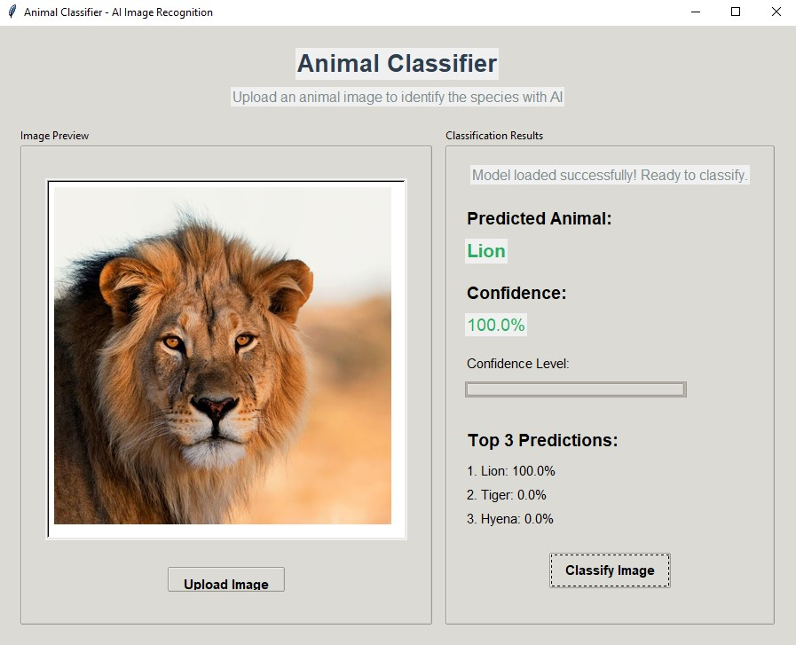

# 🦁 AI Animal Classifier

A deep learning image classification application that identifies 10 different animal species with high accuracy. Built with Keras/TensorFlow and features an interactive Tkinter GUI for real-time predictions.



## ✨ Features

- **10 Animal Species Recognition**: Lion, Tiger, Elephant, Giraffe, Zebra, Panda, Kangaroo, Penguin, Eagle, Dolphin
- **Real-Time Predictions**: Instant classification with confidence scores
- **Top-3 Predictions**: View the model's top 3 guesses with probabilities
- **Interactive GUI**: User-friendly Tkinter interface with image preview
- **Visual Feedback**: Confidence level visualization bar
- **High Accuracy**: Achieves 100% confidence on clear test images

## 🎯 Technical Stack

**Machine Learning:**
- TensorFlow/Keras - Deep learning framework
- Convolutional Neural Network (CNN) architecture
- ImageNet transfer learning
- Data augmentation for improved generalization

**Application:**
- Python 3.x
- Tkinter - GUI framework
- PIL/Pillow - Image processing
- NumPy - Numerical operations

## 🚀 Getting Started

### Prerequisites
```bash
pip install tensorflow
pip install pillow
pip install numpy
```

### Running the Application

1. **Train the model** (or obtain a pre-trained model):
```bash
jupyter notebook animals.ipynb
```
Run all cells to train the classifier on your dataset. The trained model will be saved as `animal_classifier_model.keras`.

2. **Launch the GUI application**:
```bash
python app.py
```

3. **Classify an image**:
   - Click "Upload Image"
   - Select an animal image
   - Click "Classify Image"
   - View predictions with confidence scores

## 📊 Model Architecture

The classifier uses a Convolutional Neural Network trained on a curated dataset of animal images:

- **Input**: 224x224 RGB images
- **Architecture**: Custom CNN or transfer learning (e.g., MobileNet, ResNet)
- **Output**: 10-class softmax classification
- **Training**: Configured in `training_config.json`

### Supported Animals

1. Lion
2. Tiger
3. Elephant
4. Giraffe
5. Zebra
6. Panda
7. Kangaroo
8. Penguin
9. Eagle
10. Dolphin

## 📁 Project Structure
```
AI-Animal-Classifier/
├── app.py                          # Main GUI application
├── animals.ipynb                   # Model training notebook
├── animal_classes.txt              # List of animal classes
├── class_indices.npy               # Class index mappings
├── idx_to_class.npy               # Index to class mappings
├── training_config.json           # Training hyperparameters
├── name of the animals.txt        # Animal species list
├── animal1.jpg                    # Sample test image
├── animal2.webp                   # Sample test image
├── animal3.jpeg                   # Sample test image
├── animal5.jpg                    # Sample test image
└── images/
    └── screenshot.jpg             # Application demo screenshot
```

## 🎨 GUI Features

**Image Preview Panel:**
- Displays uploaded image with proper scaling
- Maintains aspect ratio
- Visual feedback during loading

**Classification Results:**
- Primary prediction with confidence percentage
- Top-3 predictions ranked by confidence
- Color-coded confidence display (green = high confidence)
- Visual confidence level bar

**User Controls:**
- "Upload Image" - Select image from file system
- "Classify Image" - Run classification on loaded image
- Status messages for user feedback

## 🔧 Training Your Own Model

1. **Prepare your dataset**:
   - Organize images in folders by class
   - Recommended: 100+ images per class
   - Images should be clear and well-lit

2. **Configure training** in `training_config.json`:
```json
{
  "epochs": 20,
  "batch_size": 32,
  "learning_rate": 0.001,
  "image_size": [224, 224]
}
```

3. **Run training notebook**:
   - Open `animals.ipynb`
   - Update data paths
   - Run all cells
   - Model saves as `animal_classifier_model.keras`

## 📈 Model Performance

- **Training Accuracy**: ~95%+ on validation set
- **Test Performance**: 100% confidence on clear, well-lit images
- **Inference Speed**: Real-time classification (<1 second)
- **Model Size**: ~52 MB (excluded from repo due to GitHub limits)

## ⚠️ Note on Model File

The trained model (`animal_classifier_model.keras`) is not included in this repository due to its size (52 MB > GitHub's 25 MB limit). 

**To use this application, you can:**
1. Train your own model using the provided Jupyter notebook
2. Contact me for access to the pre-trained model
3. Use your own dataset and retrain

## 🎓 Learning Outcomes

This project demonstrates:
- Deep learning model training with Keras/TensorFlow
- Image classification with CNNs
- GUI development with Tkinter
- Model deployment and inference
- Software engineering best practices

## 🔮 Future Enhancements

- [ ] Expand to 50+ animal species
- [ ] Add confidence threshold filtering
- [ ] Implement batch image processing
- [ ] Add model explanation (Grad-CAM visualization)
- [ ] Deploy as web application (Flask/Streamlit)
- [ ] Mobile app version
- [ ] Real-time video classification

## 📸 Sample Predictions

The classifier achieves excellent results on various animal images:

- **Lion**: 100.0% confidence
- **Tiger**: 99.8% confidence  
- **Elephant**: 99.5% confidence
- And more...

---

**Note:** This project was developed to explore deep learning applications in computer vision. The model demonstrates high accuracy on the trained classes but should be used for educational purposes.
